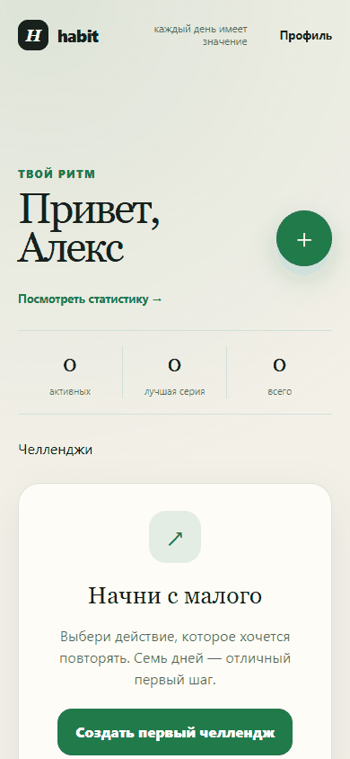

<div align="center">

# 🎯 Habit Challenge

### Telegram Mini App для привычек и совместных челленджей

Создавайте личные цели, проходите челленджи вместе с друзьями,  
отмечайте прогресс каждый день и сохраняйте серию.

<br>


<br>



</div>

---

## О проекте

**Habit Challenge** — Telegram Mini App для формирования привычек через короткие личные и групповые челленджи.

Пользователь может создать цель на **7, 14 или 30 дней**, ежедневно отмечать выполнение, следить за текущей серией и прогрессом, а также приглашать друзей в совместный челлендж через Telegram.

Главная идея проекта — превратить работу над привычками из обычного списка задач в небольшой социальный челлендж, который удобно проходить прямо внутри Telegram.

---

## Возможности

<table>
<tr>
<td width="50%">

### 🎯 Личные челленджи

Создание собственной привычки на 7, 14 или 30 дней с ежедневными отметками выполнения.

</td>
<td width="50%">

### 👥 Групповые челленджи

Возможность присоединиться к челленджу другого пользователя и проходить его вместе.

</td>
</tr>

<tr>
<td width="50%">

### 🔥 Серии и прогресс

Приложение считает текущую серию выполнений и показывает общий прогресс челленджа.

</td>
<td width="50%">

### 🏆 Лидерборд

Участники группового челленджа могут сравнивать свой прогресс в общей таблице.

</td>
</tr>

<tr>
<td width="50%">

### 🔗 Telegram Deep Links

Приглашение в челлендж работает через Telegram-ссылку с параметром `startapp`.

</td>
<td width="50%">

### 📱 Telegram UX

Поддерживаются Telegram theme variables, safe areas, Haptic Feedback и системный Share.

</td>
</tr>
</table>

---

## Демонстрация

> Здесь будет GIF с основным пользовательским сценарием приложения.

```text
Открытие Mini App
      ↓
Создание челленджа
      ↓
Ежедневный check-in
      ↓
Прогресс и серия
      ↓
Приглашение друга
      ↓
Групповой челлендж
      ↓
Лидерборд
```

---

## Как работает приложение

```text
┌─────────────────────┐
│      Telegram       │
│                     │
│     Mini App        │
└──────────┬──────────┘
           │ initData
           ▼
┌─────────────────────┐
│       Nuxt 4        │
│                     │
│ Vue + TypeScript    │
│ Pinia + Tailwind    │
└──────────┬──────────┘
           │
           │ Server API
           ▼
┌─────────────────────┐
│    Server Layer     │
│                     │
│ Services            │
│ Repositories        │
│ Telegram Auth       │
└──────────┬──────────┘
           │
           ▼
┌─────────────────────┐
│     PostgreSQL      │
│                     │
│    Drizzle ORM      │
└─────────────────────┘
```

Telegram передаёт приложению подписанный `initData`.

На сервере подпись проверяется с использованием Bot Token, после чего приложение создаёт пользовательскую сессию и работает с данными через серверный API.

Клиент не используется как доверенный источник Telegram-данных.

---

## Стек

| Направление | Технологии |
|---|---|
| Frontend | Vue 3, Nuxt 4, TypeScript |
| State management | Pinia |
| UI | Tailwind CSS 4 |
| Backend | Nuxt Server API |
| Database | PostgreSQL |
| ORM | Drizzle ORM |
| Validation | Zod |
| Telegram | Telegram Mini Apps API |
| Unit tests | Vitest |
| E2E tests | Playwright |
| Infrastructure | Docker, Docker Compose |

---

## Архитектура

Frontend разделён на функциональные слои:

```text
app/
├── entities/
├── features/
├── widgets/
├── pages/
├── shared/
├── stores/
└── plugins/
```

Такое разделение помогает отделять бизнес-сущности, пользовательские сценарии и переиспользуемые компоненты интерфейса.

Серверная часть разделена отдельно:

```text
server/
├── api/
├── database/
├── repositories/
├── services/
└── utils/
```

### Ответственность слоёв

**API**

Принимает HTTP-запросы от клиента и передаёт выполнение бизнес-логике.

**Services**

Содержат основную серверную бизнес-логику приложения.

**Repositories**

Инкапсулируют работу с базой данных.

**Database**

Содержит подключение к PostgreSQL и схему Drizzle ORM.

---

## Авторизация через Telegram

В Telegram-режиме приложение использует `Telegram.WebApp.initData`.

Сервер:

1. получает `initData`;
2. проверяет подпись Telegram;
3. проверяет актуальность `auth_date`;
4. извлекает данные пользователя;
5. создаёт серверную сессию.

Bot Token используется только на сервере и не попадает в клиентский bundle.

Для разработки также предусмотрен **demo mode**, позволяющий запустить приложение в обычном браузере без Telegram.

---

## Check-in и серии

Пользователь может отметить выполнение привычки **один раз за календарный день**.

На уровне PostgreSQL повторная отметка защищена уникальным ограничением, поэтому правило контролируется не только интерфейсом, но и базой данных.

На основе истории check-in приложение рассчитывает:

- количество выполненных дней;
- общий прогресс;
- текущую серию;
- историю активности.

В текущей версии календарный день определяется сервером в UTC.

---

## Deep Links

Для приглашения пользователей в групповой челлендж используется Telegram Deep Link:

```text
startapp=challenge_<id>
```

Пользователь открывает ссылку, запускает Mini App и может присоединиться к выбранному челленджу.

Для группового челленджа приложение формирует `https://t.me/<bot-username>?startapp=challenge_<id>` при заданном `NUXT_PUBLIC_TELEGRAM_BOT_USERNAME`. У бота должен быть настроен Main Mini App через BotFather; его URL должен вести на доступное по HTTPS приложение. После запуска Telegram передаёт `start_param`, приложение открывает экран приглашения, а пользователь сам нажимает «Присоединиться». До этого участником он не считается. Доступ проверяется на сервере после проверки подписанного `initData`.

«Отправить в Telegram» открывает выбор чата Telegram. «Скопировать ссылку» сохраняет прямую ссылку для ручной отправки. В обычном браузере отправка открывает Telegram в новой вкладке; системное меню macOS не используется.

Создатель может досрочно завершить челлендж: история и лидерборд сохраняются, новые отметки и вступления блокируются. Автоматическое завершение наступает после последнего календарного дня по UTC. Создатель может удалить челлендж целиком; это удаляет также участников и их отметки.

---

## Локальный запуск

Для разработки необходимы:

- Node.js 22+
- pnpm
- Docker

### 1. Клонируйте репозиторий

```bash
git clone https://github.com/D1ug0/habit_challenge.git

cd habit_challenge
```

### 2. Создайте `.env`

```bash
cp .env.example .env
```

### 3. Запустите PostgreSQL

```bash
docker compose up -d
```

PostgreSQL будет доступен на порту:

```text
5433
```

Порт `5433` используется, чтобы не конфликтовать с локальным PostgreSQL на стандартном `5432`.

### 4. Установите зависимости

```bash
pnpm install
```

### 5. Примените миграции

```bash
pnpm db:migrate
```

### 6. Запустите приложение

```bash
pnpm dev
```

По умолчанию включён:

```dotenv
NUXT_PUBLIC_DEMO_MODE=true
```

Поэтому приложение можно открыть как обычный сайт без запуска через Telegram.

---

## Telegram-режим

Для полноценного запуска внутри Telegram заполните `.env`:

```dotenv
TELEGRAM_BOT_TOKEN=<bot-token>

AUTH_SESSION_SECRET=<случайная-строка-минимум-32-символа>

NUXT_PUBLIC_DEMO_MODE=false

NUXT_PUBLIC_TELEGRAM_BOT_USERNAME=<bot-username-без-@>
```

После этого Web App URL необходимо указать в настройках бота через **BotFather**.

Telegram Mini App должен быть доступен по HTTPS.

---

## HTTPS для локальной разработки

Для тестирования приложения непосредственно внутри Telegram можно использовать HTTPS-туннель.

Например, при использовании Cloudflare Quick Tunnel:

```dotenv
NUXT_DEV_ALLOWED_HOST=random-name.trycloudflare.com
```

После изменения hostname необходимо перезапустить:

```bash
pnpm dev
```

---

<details>
<summary><b>⚙️ Основные команды проекта</b></summary>

<br>

Запуск разработки:

```bash
pnpm dev
```

Production build:

```bash
pnpm build
```

Проверка TypeScript:

```bash
pnpm typecheck
```

ESLint:

```bash
pnpm lint
```

Unit-тесты:

```bash
pnpm test
```

E2E:

```bash
pnpm test:e2e
```

Создание миграции Drizzle:

```bash
pnpm db:generate
```

Применение миграций:

```bash
pnpm db:migrate
```

Drizzle Studio:

```bash
pnpm db:studio
```

</details>

---

<details>
<summary><b>📁 Структура проекта</b></summary>

<br>

```text
habit_challenge/
│
├── app/
│   ├── entities/
│   ├── features/
│   ├── pages/
│   ├── plugins/
│   ├── shared/
│   ├── stores/
│   └── widgets/
│
├── server/
│   ├── api/
│   ├── database/
│   ├── repositories/
│   ├── services/
│   └── utils/
│
├── shared/
├── drizzle/
├── tests/
│
├── docker-compose.yml
├── drizzle.config.ts
├── nuxt.config.ts
├── playwright.config.ts
├── package.json
└── README.md
```

</details>

---

## Тестирование

В проекте используются два уровня автоматических тестов.

### Unit

```bash
pnpm test
```

Unit-тесты проверяют доменную логику приложения.

### E2E

```bash
pnpm test:e2e
```

Playwright используется для проверки критического пользовательского сценария приложения.

---

## Что хотелось реализовать в проекте

Habit Challenge создавался не только как интерфейс трекера привычек, но и как полноценный Telegram Mini App с серверной частью и собственной базой данных.

В проекте хотелось на практике объединить:

- Vue и Nuxt;
- TypeScript;
- Telegram Mini Apps API;
- серверную авторизацию;
- PostgreSQL;
- ORM и миграции;
- state management;
- архитектурное разделение frontend и backend;
- unit- и E2E-тестирование;
- Docker;
- работу приложения внутри Telegram.

---

## Дальнейшее развитие

В следующих версиях проект можно расширить:

- пользовательскими часовыми поясами;
- напоминаниями через Telegram-бота;
- достижениями и наградами;
- расширенной статистикой;
- дополнительными режимами челленджей;
- приватными группами;
- реакциями участников;
- push-сценариями через Telegram Bot API.

---

<div align="center">

### Habit Challenge

**Маленькие действия каждый день превращаются в привычку.**

</div>
